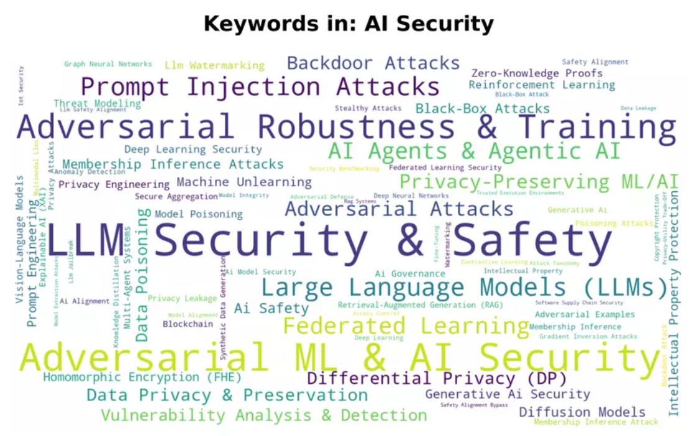
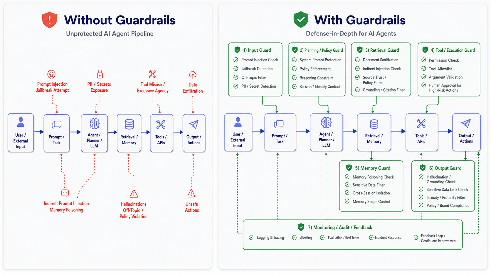

# AWESOME-AI-Security

A curated list of AI Security papers, standards, tools, and repositories for learning **LLM Security**, **Agent Security**, **Red Teaming**, and **Runtime Guardrails**.

---

## Table of Contents

* [OWASP & NIST](#owasp--nist)
* [Paper](#paper)
* [Repo](#repo)
* [AI Security Workflow](#ai-security-workflow)
* [Tool Comparison](#tool-comparison)

<p align="center">
  
</p>

<p align="center">
  
</p>

<p align="center">
  
</p>

---

## OWASP & NIST

| Time    | Title                                                                                                                                  | Org   | Type          | Note                                                               |
| ------- | -------------------------------------------------------------------------------------------------------------------------------------- | ----- | ------------- | ------------------------------------------------------------------ |
| 2026.03 | [OWASP GenAI Data Security Risks & Mitigations 2026](https://genai.owasp.org/)                                                         | OWASP | Guide         | Data security risks and mitigations for GenAI systems              |
| 2025.12 | [OWASP Top 10 for Agentic Applications 2026](https://genai.owasp.org/resource/owasp-top-10-for-agentic-applications-for-2026/)         | OWASP | Top 10        | Core risks for autonomous and agentic AI systems                   |
| 2025.12 | [Cybersecurity Framework Profile for Artificial Intelligence](https://www.nist.gov/itl/ai-risk-management-framework)                   | NIST  | Draft Profile | Cybersecurity framework profile for AI systems                     |
| 2025.11 | [OWASP AI Testing Guide](https://github.com/OWASP/www-project-ai-testing-guide)                                                        | OWASP | Testing Guide | Practical guide for testing AI system security and trustworthiness |
| 2025.03 | [Adversarial Machine Learning: A Taxonomy and Terminology of Attacks and Mitigations](https://csrc.nist.gov/pubs/ai/100/2/e2025/final) | NIST  | Taxonomy      | Core taxonomy for AI attacks, defenses, and mitigations            |

---

## Paper

### Agent AI Security Survey

| Time    | Title                                                                                                                                               | Venue | Code |
| ------- | --------------------------------------------------------------------------------------------------------------------------------------------------- | ----- | ---- |
| 2026.06 | [Toward Secure LLM Agents: Threat Surfaces, Attacks, Defenses, and Evaluation](https://arxiv.org/abs/2606.10749)                                    | arXiv | -    |
| 2026.04 | [A Systematic Survey of Security Threats and Defenses in LLM-Based AI Agents: A Layered Attack Surface Framework](https://arxiv.org/abs/2604.23338) | arXiv | -    |

---

## Repo

| Repo                                                                  | Category                     | Stage                 | Description                                                                                                                |
| --------------------------------------------------------------------- | ---------------------------- | --------------------- | -------------------------------------------------------------------------------------------------------------------------- |
| [promptfoo / promptfoo](https://github.com/promptfoo/promptfoo)       | LLM Testing / Red Team       | Dev & CI/CD           | Test prompts, agents, and RAGs. Useful for regression tests, model comparison, and AI vulnerability testing                |
| [NVIDIA / garak](https://github.com/NVIDIA/garak)                     | LLM Vulnerability Scanner    | Security Audit        | Scan LLM applications for prompt injection, jailbreaks, data leakage, hallucination, toxicity, and other model-level risks |
| [microsoft / PyRIT](https://github.com/microsoft/PyRIT)               | GenAI Red Team Framework     | Security Audit        | Automate multi-turn red teaming for GenAI systems and simulate adversarial conversations against agents                    |
| [NVIDIA / SkillSpector](https://github.com/NVIDIA/SkillSpector)       | Agent Skill Security         | Supply Chain Security | Scan third-party AI agent skills, tools, plugins, and repositories before installation                                     |
| [protectai / llm-guard](https://github.com/protectai/llm-guard)       | Runtime Input / Output Guard | Production Runtime    | Detect, sanitize, and block unsafe prompts and responses in real time                                                      |
| [NVIDIA-NeMo / Guardrails](https://github.com/NVIDIA-NeMo/Guardrails) | Runtime Guardrails           | Production Runtime    | Add programmable guardrails for input, dialog flow, retrieval, tool execution, and output control                          |

---

## AI Security Workflow

```text
[ Development & Deployment ]

1. Dev & CI/CD
   └── promptfoo
       ├── Test prompt behavior
       ├── Test RAG quality
       ├── Test agent logic
       ├── Run regression tests
       └── Integrate into GitHub Actions / CI pipeline

2. Security Audit
   ├── garak
   │   ├── Scan common LLM vulnerabilities
   │   ├── Test prompt injection
   │   ├── Test jailbreaks
   │   ├── Test data leakage
   │   └── Generate security reports
   │
   └── PyRIT
       ├── Simulate multi-turn attackers
       ├── Test complex adversarial conversations
       ├── Evaluate agent behavior under attack
       └── Test tool misuse and sensitive data leakage

3. Supply Chain Security
   └── SkillSpector
       ├── Scan third-party skills
       ├── Detect risky instructions
       ├── Detect malicious patterns
       ├── Review tool permissions
       └── Check before giving tools to an AI agent


[ Production Runtime ]

4. Real-Time Protection
   ├── llm-guard
   │   ├── Input scanning
   │   ├── Output scanning
   │   ├── PII / secret detection
   │   ├── Prompt injection detection
   │   └── Response sanitization
   │
   └── NeMo Guardrails
       ├── Input guardrails
       ├── Dialog guardrails
       ├── Retrieval guardrails
       ├── Tool / execution guardrails
       └── Output guardrails
```

---

## Tool Comparison

| Tool                                                         | Test Before Deploy | Real-Time Protection | Agent Security | Prompt Injection | Jailbreak | Data Leakage | Tool Misuse | Skill / Plugin Risk |
| ------------------------------------------------------------ | -----------------: | -------------------: | -------------: | ---------------: | --------: | -----------: | ----------: | ------------------: |
| [promptfoo](https://github.com/promptfoo/promptfoo)          |                  ✅ |                    ❌ |              ✅ |                ✅ |         ✅ |            ✅ |           ✅ |                   ❌ |
| [garak](https://github.com/NVIDIA/garak)                     |                  ✅ |                    ❌ |             ⚠️ |                ✅ |         ✅ |            ✅ |          ⚠️ |                   ❌ |
| [PyRIT](https://github.com/microsoft/PyRIT)                  |                  ✅ |                    ❌ |              ✅ |                ✅ |         ✅ |            ✅ |           ✅ |                   ❌ |
| [SkillSpector](https://github.com/NVIDIA/SkillSpector)       |                  ✅ |                    ❌ |              ✅ |                ❌ |         ❌ |           ⚠️ |           ✅ |                   ✅ |
| [llm-guard](https://github.com/protectai/llm-guard)          |                 ⚠️ |                    ✅ |             ⚠️ |                ✅ |        ⚠️ |            ✅ |           ❌ |                   ❌ |
| [NeMo Guardrails](https://github.com/NVIDIA-NeMo/Guardrails) |                 ⚠️ |                    ✅ |              ✅ |                ✅ |         ✅ |            ✅ |           ✅ |                   ❌ |

Legend:

* ✅ Strong fit
* ⚠️ Partial fit / depends on setup
* ❌ Not the main purpose

---
